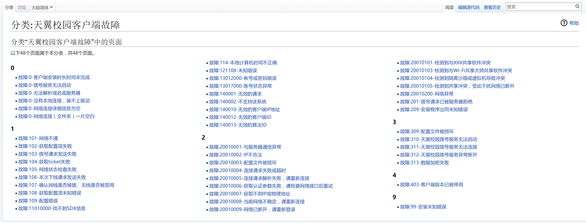

# 网络维护科开发组
网络维护科开发组成立于2015级，目前成员7人。
致力于提升组织内成员工作的工作效率，简化工作流程。

## 我们主要负责什么工作？
网络维护科开发组主要负责对网络维护科组织下的网站进行维护及开发。

### 网络维护科官网
网络维护科的门户网站，主要由静态页面构成。

### 微信报修系统
搭建在微信公众平台上的报修系统。自2016年投入使用，是目前主要的网络报修途径。

### 成员工作系统
值班时要用到的系统。

### Wiki百科
网络维护科Wiki百科收录了校园网使用过程中可能遇到的问题及其解决方案。

## 为什么要加入我们？

### 科技创新奖
网络维护科设有科技创新奖（奖金2000元），该奖项将颁发给在学年中有出色作品的个人或团队。

### 二轮免试
对网络维护科有突出贡献的，可以获得二轮免试的资格。（可提前享受正式成员福利）

## 加入我们有什么要求？
网络维护科开发组现面向2017级新成员招收以下方向的组员

### Wiki页面管理与维护

#### 工作内容
负责维护Wiki页面的正常运转、丰富并完善Wiki的内容。

#### 基本要求
- 对维基百科的运作形式有所了解

#### 加分项
- 有维基百科的编辑经验
- 了解PHP
- 了解Linux操作系统

### Web前端开发

#### 工作内容
负责开发网站的前端部分。

#### 基本要求
- 对HTTP协议有基本认识

#### 加分项
- 了解 HTML/CSS/JavaScript

### Web后端开发

#### 工作内容
负责开发网站的后端部分。

#### 基本要求
- 对HTTP协议有基本认识

#### 加分项
- 了解任意一门后端语言或框架

## 如何加入我们？
https://goo.gl/forms/9sYR8e7EXJOV89353

## FAQ
Any problems? go [HERE](https://github.com/ZSCNetSupportDept/About/issues).
